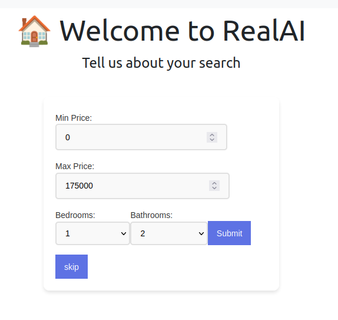
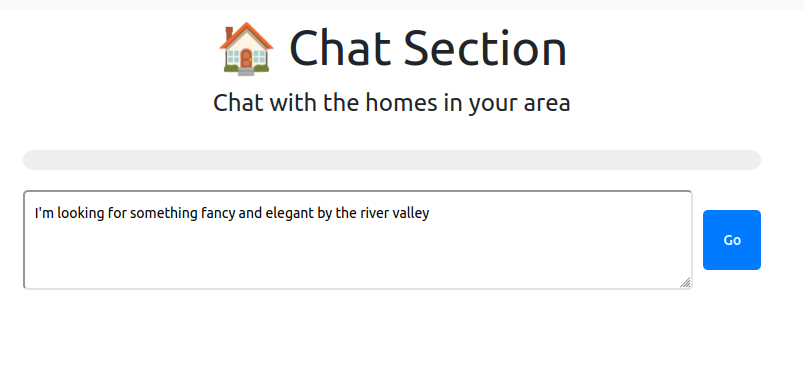
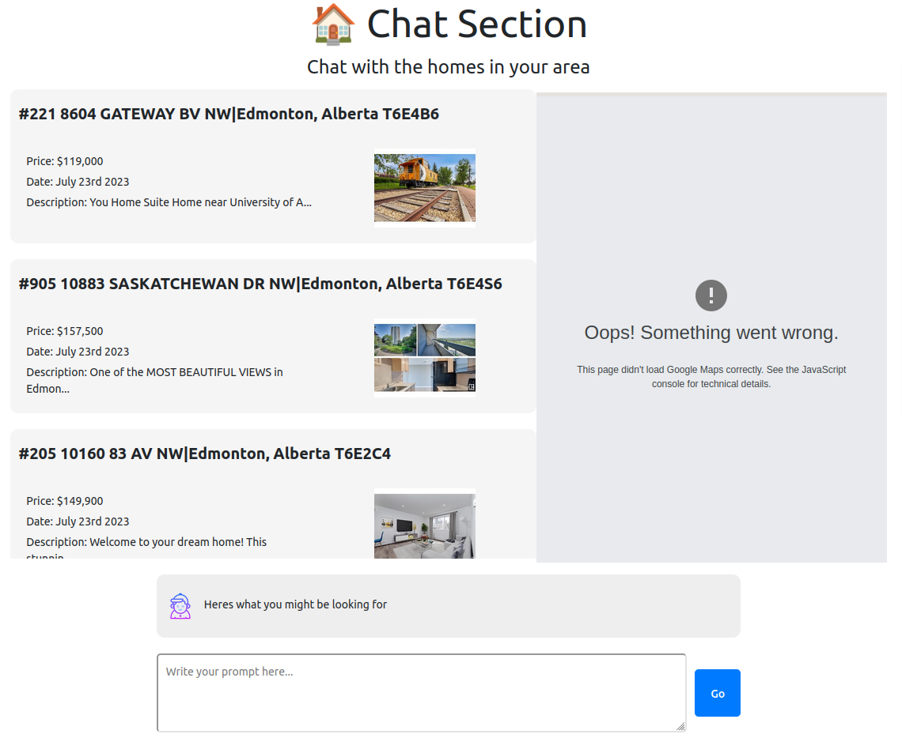

# RealAI
A chatbot made to help you find real estate listings.

## How does it work?

### 1. You start by inputting quantitative restraints that you're looking for 


Its important to note that although our min and max price filters are implemented,
the Bedrooms and Bathrooms are not currently. 

### 2. You then describe the Qualitative features that your looking for



### 3. Browse through the top 3 results tailored to your needs 



## Hack GPT Dev Repo

### App Structure
```
.
├── app.py
├── client
│   ├── build
│   ├── node_modules
│   ├── package.json
│   ├── package-lock.json
│   ├── public
│   ├── README.md
│   └── src
├── llm
│   └── README.md
├── README.md
└── requirements.txt

11 directories, 8 files
```

### Installation

Clone repo
`git clone git@github.com:JustinMeimar/hack-gpt-dev.git`

Navigate into repo
`cd hack-gpt-dev`

Make a virtual environment
`python -m venv env` 

Install dependencies
`pip install -r requirements.txt`
`python3 app.py`

Install the frontend
`npm install`

Build the frontend
`cd /app/client`
`npm build`

Run the server locally
`cd app && python manage.py runserver`

### OpenAI Authentication
Create the file `app/api/llm/.env` and add the OpenAI Credentials in the form
```
OPENAI_API_KEY = <"OPEN_AI_API_KEY">
OPENAI_ORG_ID = "<"OPENAI_ORG_ID">
```  

### Making Changes

The React frontend is served by the file `app/client/build/index.html`, so to make changes to the frontend run `npm run build` from `app/client`
